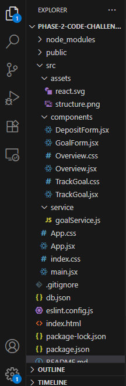

# 🧠 Smart Goal Planner

A React-based web application that allows users to set, track, and manage financial savings goals. The app supports full CRUD operations and tracks progress toward custom financial goals using a JSON server as a mock backend.

## 🚀 Features

- Add, edit, and delete financial goals
- Set deadlines and track days remaining
- View progress visually with a progress bar
- Make deposits towards goals and update savings
- Automatically calculate remaining amount and percentage completion
- Clear and responsive user interface

## 🛠 Tech Stack

- **Frontend:** React, CSS
- **Backend (Mock API):** `json-server`
- **Tools:** Vite, npm

## 📦 Installation

1. **Clone the repository**
```bash
git clone git@github.com:Jimmy-wq-code/code-Challenge1.git
```
then navigate to that directory :
```
cd  code-challenge1
```

2. **Install dependencies**
```
npm install
```
3. **Start the mock backend server**
```
npx json-server --watch db.json --port 3000
```
4. **Start the React app**
```
npm run dev

```
## Project Structure 

Her is  a screenshoot of the project structure :
|Project Structure |
|-------------|
||

## Future Improvements
- Add authentication
- Add notifications for nearing deadlines

## Acknowledgments
Moringa School for this fun and interactive project and also for their support

Also for that they provide the local JSON and db.json Structure
